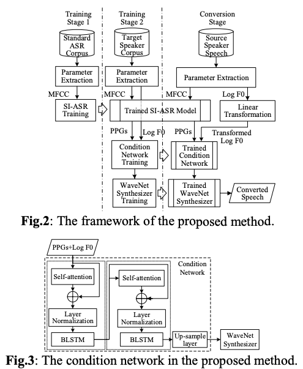
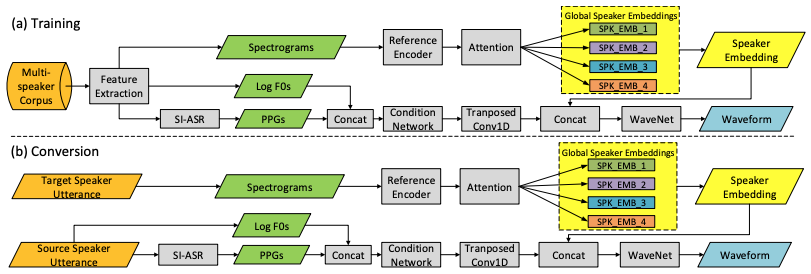

# Voice Conversion
Voice conversion (VC) is a technique to modify the speech from source speaker to make it sound like being uttered by a target speaker while keeping the linguistic content unchanged.
Many methods of VC require the target speaker has many speech data for training. However, one-shot VC just need one utterance from the target speaker.  
According to the number of source and target speakers, VC system can be classified as one-to-one, one-to-many, many-to-one, and many-to-many systems. 

## A Compact Framework for Voice Conversion Using Wavenet Conditioned on Phonetic Posteriorgrams
Paper [2] is from professor Zhiyong Wu, Tsinghua University, China.
There are many common structures to their following paper [1].  The WaveNet vocoder, PPG network, speaker encoder, and the idea of using conditioning are nearly the same.
### Background
Many approaches  of VC systems segregate the training procedure of conversion and vocoder module, with different optimization objectives, which may lead to the difficulty in model tuning and coordination.
### Contribution
Paper [2] proposed a compact framework to unify the conversion and vocoder parts.
### Methods
The WaveNet vocoder is employed to generate the speech of target speaker, conditioning on the intermediate representation of PPGs. 
The PPGs representation is extracted by multi-head attention structure and BLSTM. 
The method to unify the conversion function and the vocoder is:
1. Extract speaker independent linguistic features from the source speaker’s speech;
2. Encode the linguistic features and the f0 using self-attention structures and BLSTM;
3. Up-sampling the encoded features into the desired resolution of WaveNet to generate the target speaker’s waveform.

The proposed method is shown in this figure:

There are two training stages. The first stage is to train a ASR model to extract the PPGs. And the second stage is to train a WaveNet vocoder, who's directly conditioned on the PPGs and F0.

To up-sample the PPGs to frame-level length and capture some global information such as phrase level contexts, the authors use a condition network, which is composed of self-attention and blstm blocks. 

### Experiment
Baseline is a separately trained conversion module and WaveNet vocoder. 
The baseline method [3] uses phonetic posterior-grams to do many-to-one voice conversion, who architecture is depicted in the following figure:

### Findings
The proposed method can achieve better results in naturalness and similarity.

### Details
Phonetic posterior-grams (PPGs) are generally considered as speaker independent features containing linguistic information. A PPG is a time sequence representing the posterior probability of each [senone](https://stats.stackexchange.com/q/342497) for each time frame of an utterance. The number of frames each senone lasts reveals the duration information. The PPGs can be extracted from utterance using ASR method. The PPGs can be easily converted into conrrespoding phoneme or even word sequence, but commonly it’s bettor not to do that for two reasons: 1) PPGs can capture the composition of different senons and its temporal changes, which can obtain more accurate estimates of acoustic parameters; 2) The duration information is damaged when mapping posterior probability into phoneme sequence [2].

The training of method [3] (baseline method of paper [2]) includes three stages:

1. Train the ASR system on a ASR corpus to extract PPGs;
2. Train BLSTM to convert PPGs into Mel-cepstral coefficients (MCEPs) frame by frame;
3. Train WaveNet conditioning on logarithm F0 and MCEPs (after up-sampling);

During the inference stage (conversation) of [3], the source speaker's speech is first transformed into PPGs via the ASR model. Then, the BLSTM model converts the PPGs into the MCEPs. Then, the WaveNet conditioning on MCEPs and F0 generates the waveforms of target speakers.

Note that since the F0 is from the source speaker, the authors used a simple linear transformation to convert it into that of the target speaker.

## One-shot Voice Conversion with Global Speaker Embeddings
Paper [1] is also from professor Zhiyong Wu,Tsinghua University, China.
### Background
Building a VC system for a new target speaker requires a large amount of speech data from the target speaker.
### Contribution
Paper [1]  proposed a method to build a VC system using just one utterance from an arbitrary target speaker, and no need any adaptation training. 
### Methods
They proposed to use global speaker embeddings (GSE), which is inspired from global style tokens (GST), to control the converted targets speech. Besides that, speaker-independent phonetic  posterior-grams (PPG) are employed as the local conditions.
To generate the waveform of the target speaker, the conditional WaveNet synthesizer is used. The GSE and PPG are the global and local conditioning of the WaveNet. 
To get the embeddings  of target speakers, the utterance of target speaker is firstly fed into a speaker encoder network to generate the reference embedding, which is then employed as attention query to the GSEs  to produce the speaker embedding. The procession is exactly to the GST vectors.

The architecture of the method is shown in the following figure:

During the training phrase, the conditional WaveNet model is trained on a multi-speaker dataset. The WaveNet is conditioned on three factors: 1) PPGs, 2) F0s, and 3) speaker reference embeddings. The F0s are z-normalized to remove the speaker identity-related information, and the reference embedding is extracted from an random-chosen utterance of the same speaker, which ensures that reference embedding is only related to the speaker identity and has no overlap with the linguistic information. 

The conversion phrase is almost the same to the training stage, except that the speaker embedding is extracted from the target speaker.

### Experiment
Baseline method is an adaptation training baed any-to-any VC system.
### Findings
The proposed method performs equally well or better in both speech naturalness and speaker similarity. 
The proposed method has higher flexibility than the baseline.

# References
1. One-shot Voice Conversion with Global Speaker Embeddings, https://www.isca-speech.org/archive/Interspeech_2019/pdfs/2365.pdf
2. A Compact Framework for Voice Conversion Using Wavenet Conditioned on Phonetic Posteriorgrams. https://ieeexplore.ieee.org/document/8682938
3. Phonetic posteriorgrams for many-to-one voice conversion without parallel data training. https://ieeexplore.ieee.org/document/7552917
